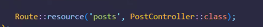

# Authentication 

<p>For every input exists only one hash. Before saving smth important it is necessary to hash the sensible information.</p>

## Attention! ⚠️
<p>It is not possible to uncrypt the password. It is not reversible!</p>

## Process

1. Create a new file laravel 

```bash

laravel new name-of-project --git

```

2. Connect the database by modifying the .env file

3. Install Laravel Breeze

```bash

composer require laravel/breeze --dev

```
4. Install Laravel Breeze

```bash

php artisan breeze:install

```
5. Select these things in order

<p>blade</p>
<p>no</p>
<p>1</p>

6. Install the package for vite ecc.

```bash

composer require pacificdev/laravel_9_preset

```

7. Install bootstrap with --auth 

```bash

php artisan preset:ui bootstrap --auth 

```
8. Install vite depencencies after modifying vite.config.js in vite.config.cjs or by deleting 'type' = 'modules' in package.json with:

```bash

npm i && npm run dev 

```
9. Then open the file online with 

```bash

php artisan serve

```

10. Delete edit.blade.php and guest.blade.php because not necessary

11. Open MAMP and make a migration
```bash

php artisan migrate

```
<p>then type or select yes</p>

12. Refactor

```bash

php artisan make:controller Admin/DashboardController

```

13. in web.php

```bash
/*Admin route*/
Route::middleware('auth', 'verified')->prefix('admin')->name('admin.')->group(function () {
    Route::get('/', [DashboardController::class, 'index'])->name('dashboard');
});


```

14. in DashboardController add function

```bash
   public function index()
    {
        return view('admin.dashboard');
    }
```
15. copy and paste in layouts the app.blade.php and rename it in admin.blade.php and create a new layout 

16. in admin.blade.php add this template and remember to add the dropdown after logout

```admin.blade.php

<!doctype html>
<html lang="{{ str_replace('_', '-', app()->getLocale()) }}">

<head>
    <meta charset="utf-8">
    <meta name="viewport" content="width=device-width, initial-scale=1">

    <!-- CSRF Token -->
    <meta name="csrf-token" content="{{ csrf_token() }}">

    <title>{{ config('app.name', 'Laravel') }}</title>

    <!-- Fontawesome 6 cdn -->
    <link rel='stylesheet' href='https://cdnjs.cloudflare.com/ajax/libs/font-awesome/6.2.0/css/all.min.css' integrity='sha512-xh6O/CkQoPOWDdYTDqeRdPCVd1SpvCA9XXcUnZS2FmJNp1coAFzvtCN9BmamE+4aHK8yyUHUSCcJHgXloTyT2A==' crossorigin='anonymous' referrerpolicy='no-referrer' />

    <!-- Fonts -->
    <link rel="dns-prefetch" href="//fonts.gstatic.com">
    <link href="https://fonts.googleapis.com/css?family=Nunito" rel="stylesheet">

    <!-- Usando Vite -->
    @vite(['resources/js/app.js'])
</head>

<body>
    <div id="app">

        <header class="navbar navbar-dark sticky-top bg-dark flex-md-nowrap p-2 shadow">
            <a class="navbar-brand col-md-3 col-lg-2 me-0 px-3" href="/">BoolPress</a>
            <button class="navbar-toggler position-absolute d-md-none collapsed" type="button" data-bs-toggle="collapse" data-bs-target="#sidebarMenu" aria-controls="sidebarMenu" aria-expanded="false" aria-label="Toggle navigation">
                <span class="navbar-toggler-icon"></span>
            </button>
            <input class="form-control form-control-dark w-100" type="text" placeholder="Search" aria-label="Search">
            <div class="navbar-nav">
                <div class="nav-item text-nowrap ms-2">
                    <a class="nav-link" href="{{ route('logout') }}" onclick="event.preventDefault();
                    document.getElementById('logout-form').submit();">
                        {{ __('Logout') }}
                    </a>
                    <form id="logout-form" action="{{ route('logout') }}" method="POST" class="d-none">
                        @csrf
                    </form>
                </div>
                <!-- <ul>
                    <li class="nav-item dropdown">
                        <a id="navbarDropdown" class="nav-link dropdown-toggle" href="#" role="button" data-bs-toggle="dropdown" aria-haspopup="true" aria-expanded="false" v-pre>
                            {{ Auth::user()->name }}
                        </a>

                        <div class="dropdown-menu dropdown-menu-right" aria-labelledby="navbarDropdown">
                            <a class="dropdown-item" href="{{ url('dashboard') }}">{{__('Dashboard')}}</a>
                            <a class="dropdown-item" href="{{ url('profile') }}">{{__('Profile')}}</a>
                            <a class="dropdown-item" href="{{ route('logout') }}" onclick="event.preventDefault();
                                                     document.getElementById('logout-form').submit();">
                                {{ __('Logout') }}
                            </a>

                            <form id="logout-form" action="{{ route('logout') }}" method="POST" class="d-none">
                                @csrf
                            </form>
                        </div>
                    </li>
                </ul> -->
            </div>
        </header>

        <div class="container-fluid vh-100">
            <div class="row h-100">
                <!-- Definire solo parte del menu di navigazione inizialmente per poi
								aggiungere i link necessari giorno per giorno
								 -->
                <nav id="sidebarMenu" class="col-md-3 col-lg-2 d-md-block bg-dark navbar-dark sidebar collapse">
                    <div class="position-sticky pt-3">
                        <ul class="nav flex-column">
                            <li class="nav-item">

                                <a class="nav-link text-white {{ Route::currentRouteName() == 'admin.dashboard' ? 'bg-secondary' : '' }}" href="{{route('admin.dashboard')}}">
                                    <i class="fa-solid fa-tachometer-alt fa-lg fa-fw"></i> Dashboard
                                </a>
                            </li>

                        </ul>


                    </div>
                </nav>

                <main class="col-md-9 ms-sm-auto col-lg-10 px-md-4">
                    @yield('content')
                </main>
            </div>
        </div>

    </div>
</body>

</html>

```
17. In terminal write the command to add storage for future imgs

```bash

php artisan storage:link

```

18. In RouteServiceProvider modify dashboard in 'admin'

19. create model and controller and everything else by using -a

```bash

php artisan make:model Post -a

```

20. Add in PostController this:

```PostController.php

👉 namespace App\Http\Controllers\Admin;

use App\Models\Post;
use App\Http\Requests\StorePostRequest;
use App\Http\Requests\UpdatePostRequest;
👉use App\Http\Controllers\Controller;

```

21. Delete policies in Http

22. write columns of our migrations table

23. Fill seeder and add model post and str helper remember to add it at the beginnig of the file

24. use $this->class in database seeder

25. migrate the database

26. seed the table

27. In web.php in amdin section


28. in postcontroller complete all the fields

29. Create a new folder named posts in the views that will contain all the blade files connected to the PostController (index.blade.php, edit.blade.php, show.blade.php, store.blade.php ecc.). The files' content is similar to what is done in the laravel-dc-comics project.

30. 

### To paginate

php artisan vendor:publish

laravel-pagination
